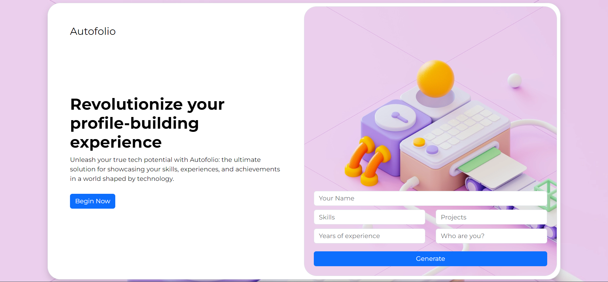

# Introducing AutoFolio: The Ultimate Profile Generator for Tech Enthusiasts!

AutoFolio is an innovative profile generator powered by artificial intelligence (AI) technology. It revolutionizes the way professionals create their profiles by automating the process and delivering exceptional results.
With AutoFolio, crafting a standout profile becomes effortless. 
Whether you're a job seeker, freelancer, or business professional, AutoFolio empowers you to create an exceptional profile that effectively showcases your skills and experiences. Say goodbye to generic profiles and hello to a personalized, compelling, and impactful representation of your professional self with "AutoFolio".

Key Features:

+ AI-Powered Profile Generation: AutoFolio utilizes cutting-edge artificial intelligence algorithms to analyze your professional information and generate a compelling profile that highlights your strengths and accomplishments.

+ Time-Saving Automation: By automating the profile generation process, AutoFolio saves your valuable time and effort. No more struggling with wording or formatting; let AutoFolio handle the heavy lifting while you focus on other important tasks.

+ Enhanced Personal Branding: With AutoFolio, you can create a powerful personal brand that accurately represents your professional identity. The generated profile presents you as a standout candidate or professional, helping you leave a lasting impression.

+ Industry-Relevant Optimization: AutoFolio stays up-to-date with the latest industry trends, keywords, and formatting guidelines to ensure your profile aligns with current expectations. This optimization maximizes your chances of getting noticed by employers and recruiters.

<h3 align = "center"> "AutoFolio: Your Passport to Professional Success,  Where AI Unleashes the Power of Your Profile." </h3>
